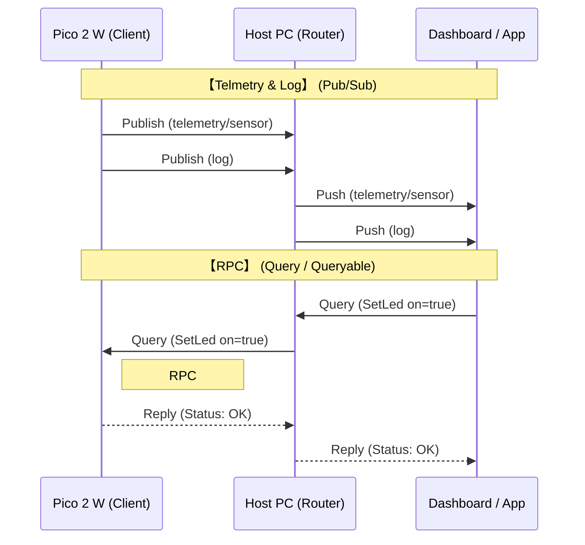
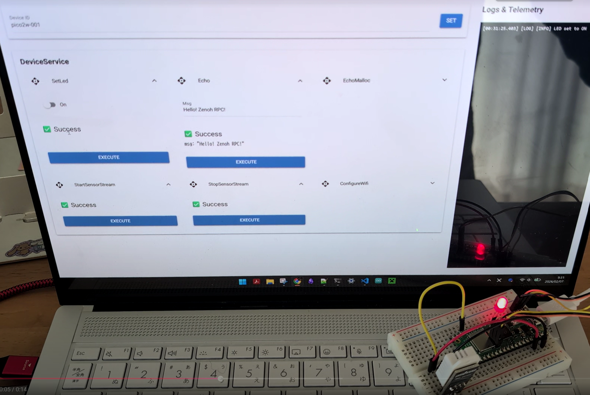
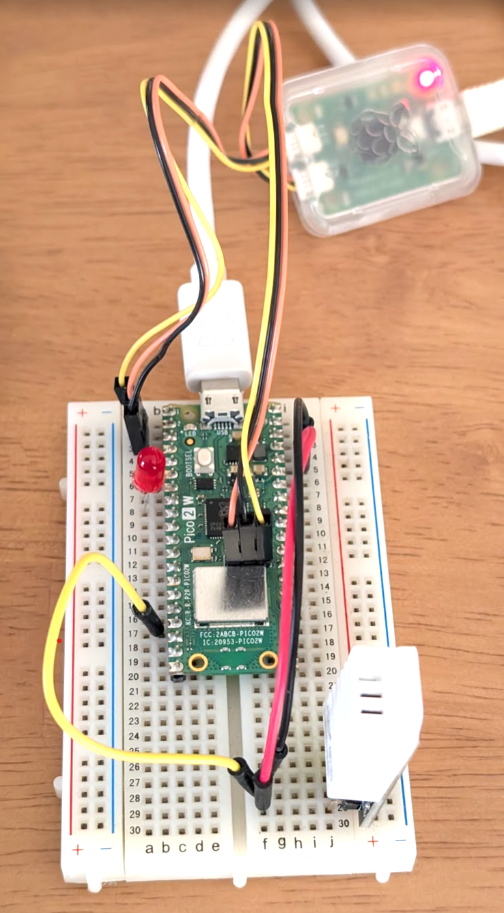

#  Zephyr Zenoh RPC

Protocol Buffers + Zenoh RPC example on Raspberry Pi Pico 2 W with Zephyr RTOS.



RPC Server, Client and GUI is generated from Protocol Buffer Schema!



## Hardware

- Raspberry Pi Pico 2 + Debug Probe
- LED
- DHT22 



## Environment setup

In Devcontainer, execute following command.

```bash
uv venv 
uv sync
source .venv/bin/activate
west init -l manifest
west update
west zephyr-export
uv run west list # Check modules
uv pip install -r modules/lib/zephyr/scripts/requirements.txt
west blobs fetch hal_infineon # Fetch Infineon blobs for pico2 w
sudo chmod a+x -R ./generator
```

## Build

```bash
west build -p -b rpi_pico2/rp2350a/m33/w apps/zenoh_rpc
```
## Flash and Run

Flash FW via OpenOCD.

```bash
sudo openocd -s tcl -f interface/cmsis-dap.cfg -f target/rp2350.cfg -c "adapter speed 5000" -c "program build/zephyr/zephyr.elf verify reset exit"
```

## UART log

Watch UART log via picocom.

```bash
picocom /dev/ttyUSB0 -b 921600
```

## Easy way to build, flash and montitor

```bash
python build.py
```

Options of build.py is following:

```txt
  -h, --help            show this help message and exit
  -a APP, --app APP     Application directory (default: apps/zenoh_rpc)
  -p, --pristine        Pristine build (clean rebuild)
  --build-only          Only build, don't flash or monitor
  --flash-only          Only flash, don't build or monitor
  --port PORT           Serial port for monitoring (auto-detect if not specified)
  --baudrate BAUDRATE   Serial baudrate (default: 921600)
  --runner {openocd,uf2,probe-rs,jlink}
                        Flash runner to use (default: openocd)
```

## Control MCU with Python script or GUI

Start Zenoh Router, this script launches `zenohd` with serial option.

```bash
uv run tools/start_router.py
```

Control MCU with example zenoh client on PC

```bash
uv run tools/example_client.py
```

Launch GUI application
```bash
uv run tools/gui.py
```

## Directory structure

```txt
.
├── build.py                    # Build, flash, and monitor script
├── pyproject.toml              # Python dependencies (uv)
├── manifest/
│   └── west.yml                # Zephyr manifest
├── generator/                  # Protobuf code generators
│   ├── gen_client_python.py   # Python client code generator
│   └── gen_server_nanopb.py   # C++ server code generator
├── apps/
│   └── zenoh_rpc/              # Main application
│       ├── service.proto       # Service definition (Protocol Buffers)
│       ├── service.options     # NanoPB options (max_size, etc.)
│       ├── main.cpp            # Application entry point
│       ├── service_impl.cpp/h  # RPC service implementation
│       ├── prj.conf            # Zephyr project configuration
│       ├── CMakeLists.txt      # CMake build script
│       ├── boards/
│       │   └── *.overlay       # Device tree overlay
│       ├── wifi/
│       │   ├── wifi_manager.cpp/h  # Wi-Fi connection manager
│       └── rpc/                # Generated code (auto-generated)
│           ├── service.pb.c/h      # NanoPB C code
│           ├── service_server.cpp/h    # RPC server stub
│           ├── zenoh_rpc_channel.cpp/h # Zenoh RPC channel
│           └── zenoh_pubsub.cpp/h      # Zenoh pub/sub utilities
├── tools/                      # PC-side Python tools
│   ├── start_router.py         # Start Zenoh router
│   ├── configure_wifi.py       # Configure Wi-Fi settings
│   ├── example_client.py       # Example RPC client
│   └── rpc/                    # Generated code (auto-generated)
│       ├── service_pb2.py      # Python Protocol Buffers
│       ├── service_client.py   # RPC client stub
│       └── zenoh_rpc_client.py # Zenoh RPC client
├── modules/lib/
│   ├── zephyr/                 # Zephyr RTOS
│   ├── zenoh-pico/             # Zenoh-Pico library
│   └── nanopb/                 # NanoPB library
└── build/                      # Build output
```